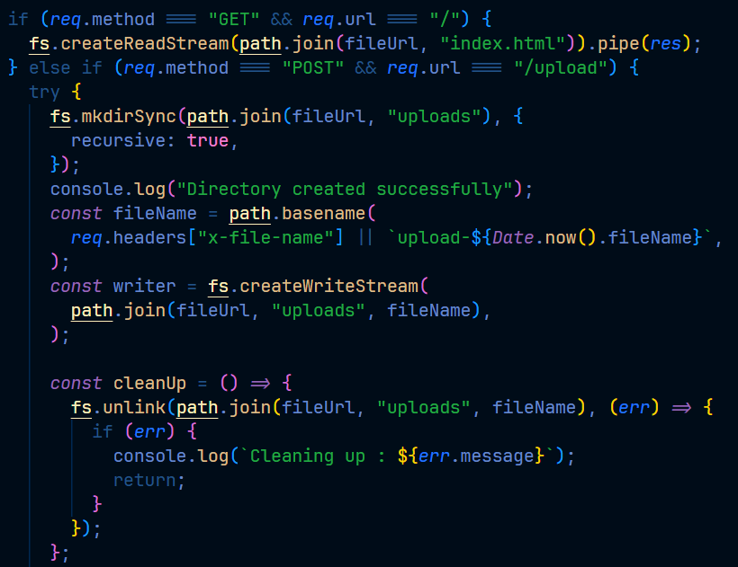

# File Upload Handler written in vanilla Node.js

## A project example on how to handle file uploads using the inbuilt Node.js stream module, which stores uploaded files directly to disk and optimizes memory usage

This code was actually written as preparation for a much larger project, and it is really helpful in showcasing the advantage of choosing a stream (`createWriteStream` and `createReadStream`) for larger file uploads instead of the `writeFile` fs method which is more suitable for handling smaller data. The entire code was written for a single endpoint called `/upload` which was consumed by the frontend, and all other methods are blocked from accessing this route. Both the frontend and backend are inside the same folder, and deployed on Render. The file shows how:

- To clean up partial files in case of an error during piping of the readable to the writable
- To handle CORS without downloading the cors package
- To block any other HTTP method from accessing the dedicated route
- To consume API endpoints using the Fetch API
- To serve a static HTML file to avoid having a double deployment for both frontend and backend

---

## Running locally

1. Clone the repo
2. Run `npm install`
3. Run `node fileUpload.js`
4. Visit `http://localhost:3000` in your browser
5. To test the endpoint directly, send a `POST` request to `http://localhost:3000/upload` with a file as the raw body and an `x-file-name` header set to the filename

```bash
curl -X POST http://localhost:3000/upload \
  --data-binary @/path/to/your/file.jpg \
  -H "x-file-name: file.jpg"
```

---

## Memory usage

The key proof of this project — heap usage stays flat regardless of file size because the file is never loaded into memory:

| File Size | Heap Used |
| --------- | --------- |
| 4KB       | 8.97MB    |
| 23KB      | 9.23MB    |
| 11MB      | 9.75MB    |

If `writeFile` had been used instead, heap usage would spike proportionally with file size. With streams, it stays flat even at 500MB+.

---

## Here is a snippet 👇


